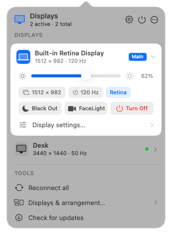
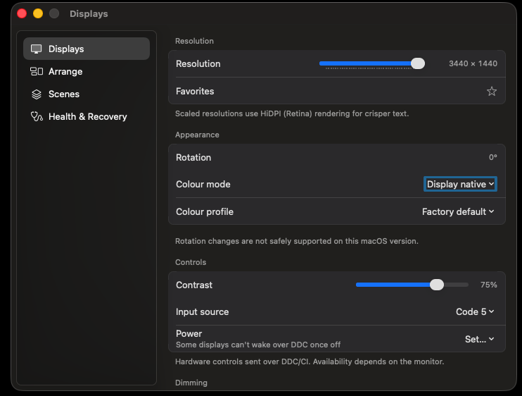

# OpenDisplay

**Free, open-source display control for macOS (Apple Silicon).** Drive your external
monitor's *real* hardware — brightness, volume, colour, input — over **DDC/CI**, from the
menu bar, your keyboard's **brightness keys**, a CLI, or Shortcuts. Plus **auto-brightness**
that follows your Mac's ambient light sensor, **scheduled brightness** anchored to sunrise and
sunset, a one-press **video-call fill light**, and **per-input hotkeys** for KVM setups. A free,
open alternative to **BetterDisplay**, **Lunar**, and **MonitorControl**.

<p align="center">
  
  &nbsp;
  
</p>

## Install

```sh
brew install --cask aquitaine/tap/opendisplay
```

…or download the notarized app from the **[latest release](https://github.com/aquitaine/OpenDisplay/releases/latest)**,
unzip, and drag **OpenDisplay.app** to Applications. It's Developer-ID-signed and notarized,
so it opens with no Gatekeeper warning. Then click the display glyph in the menu bar.

**Requires** an Apple Silicon Mac on macOS 14 (Sonoma) or later. Runs as a menu-bar item —
no Dock icon.

## What you get

- **Keyboard brightness keys** move your *external* monitor's real backlight (not a gamma
  overlay), with a native-style on-screen HUD. ⇧⌥ for fine steps.
- **Adaptive brightness** — the monitor follows your built-in display's ambient-light level;
  with the built-in off it reads the light sensor **directly**; lid closed, it uses a
  schedule. Plus **Night-Shift-following** evening colour warmth.
- **Clock Mode** — schedule brightness against fixed times or **sunrise / noon / sunset**
  (with offsets, so "70% half an hour before sunset" just works), stepped, ramped, or
  glided continuously between points.
- **Location Mode** — no sensor? Brightness can follow the **sun's actual elevation** at
  your location, computed locally from public NOAA equations — ideal for lid-closed
  setups in rooms with natural light.
- **App Presets** — per-app display presets: your video editor gets full brightness and
  its colour preset, your terminal gets 40%, and everything restores when you switch away.
- **FaceLight** — one press turns your monitor into a warm video-call fill light; press
  again and your exact previous brightness, contrast, and dimming come back.
- **XDR Brightness** (Labs) — one tap drives the MacBook Pro's XDR panel to **2× its normal
  SDR maximum**, using the HDR headroom Apple reserves for video. Public APIs only, and it
  can never outlive the app — quit (or crash) and the panel is back to normal.
- **Full DDC/CI control** — brightness, contrast, volume, input source, colour presets,
  sharpness, and RGB gain, all driving the panel's own hardware.
- **Safe by design** — every risky change is checkpointed and reversible, with a standalone
  **rescue app**, so you can pull a display off your desktop without unplugging it and always
  get it back — even the screen that was showing the app.

> Pre-1.0 and moving fast. The platform-independent core (state machines, scene planner,
> safety engine) is unit-tested; hardware paths are verified live on Apple Silicon. See the
> [CHANGELOG](CHANGELOG.md) for what's new.
>
> Independent, clean-room project — not affiliated with or endorsed by BetterDisplay, Lunar,
> or MonitorControl; no third-party names, assets, copy, UI, or code.

## Features

- **Unified brightness** for every display from one slider — built-in panels via the
  system API, external monitors over **DDC/CI**, and a universal **software (gamma)**
  fallback for displays that answer neither (including below the hardware minimum).
- **Keyboard media keys** (opt-in): your Mac's hardware brightness keys change the
  external monitor's *real backlight* over DDC — macOS-style steps (⇧⌥ for fine
  control), a native-looking on-screen HUD, and a configurable target (display under
  cursor / main display / built-in). Volume keys follow the **current sound output
  device**: when sound is routed to a monitor with DDC audio they drive its hardware
  volume; otherwise they pass through to macOS untouched.
- **Hardware controls** over DDC/CI: contrast, volume, input source, colour preset,
  **sharpness, and RGB gain** — sliders appear automatically when the monitor answers for
  them, and any other MCCS feature is reachable through the CLI's raw `vcp` command.
- **Works with your monitor:** displays are matched to their DDC channel by **EDID
  identity** (vendor / model / serial), not port order — correct on docks, mixed
  HDMI/DisplayPort setups, and identical twin monitors — with checksum-validated,
  desync-tolerant reads that recover replies from quirky panels.
- **Per-display colour profiles** (ICC) via public ColorSync — applied with validation and
  reversible to the factory profile, targeted by each display's persistent UUID.
- **Resolution, refresh rate, and HiDPI (Retina)** switching, plus **mirroring** and a
  drag-to-arrange layout canvas.
- **Safe logical disconnect / reconnect** — remove a display from the desktop without
  unplugging it, with an always-one-display-active guarantee, automatic fall-back to the
  built-in panel, and independent recovery (menu, a global hotkey, and a separate rescue app).
- **Scenes** — save a display arrangement and re-apply it later.
- **Black Out** and **software dimming** on any display.
- **Input-switch hotkeys** — bind a global chord to "this monitor, that input" and jump a
  KVM-shared display to your Mac without touching its buttons; bindings follow the physical
  monitor (EDID identity), not the port, and confirm on-screen.
- **Automation** — an `opendisplay` CLI and Shortcuts/Siri intents drive the same
  safety-checked, audited path as the UI — including `lux` (ambient-light readout), `lid`,
  and `listen`, a line-delimited JSON stream of brightness and display events for scripting.
- **XDR Brightness** (Labs, opt-in): a sun badge on the built-in's brightness row boosts SDR
  content to 2× the panel's normal maximum — the EDR-trigger + gamma-map technique, public
  Metal/CoreGraphics only. HDR content looks clipped while boosted; sustained use warms the
  panel. Session-only by design: it never survives quit or crash.
- **Labs (opt-in):** experimental display **rotation** through a sandboxed helper — off by
  default and compiled out of the public-API build entirely.

Built for **Apple Silicon**: the slow I/O (DDC/CI, private SPI, ColorSync iteration) runs
off the main thread, so the menu stays responsive while monitors are being driven.

## Coming from BetterDisplay, Lunar, or MonitorControl?

Fair comparison, honestly stated. **BetterDisplay** and **Lunar** are excellent, mature
commercial apps with features OpenDisplay doesn't have yet (virtual/dummy displays, EDID
overrides, adaptive sync tuning). **MonitorControl** is a great
free tool focused on brightness/volume keys. What OpenDisplay brings to that landscape:

- **Free and fully open source (GPL)** — every line of the DDC engine, the safety
  transaction model, and the private-API usage is inspectable.
- **External monitor hardware control**: brightness, contrast, volume, input switching,
  colour presets, sharpness, RGB gain — plus raw access to *any* VCP code from the CLI.
- **Media keys + native-style OSD**, like your monitor was built in.
- **A safety model the others don't attempt**: every risky operation goes through an
  audited transaction with checkpoints, verification, automatic rollback, an
  always-one-display-active guarantee, and a **standalone rescue app** that can recover
  your desktop even if the main app can't run.
- **Automation as a first-class citizen**: CLI, Shortcuts/Siri intents, and a URL scheme
  all drive the same audited command path as the UI.

If OpenDisplay is missing something you rely on, [open an issue](https://github.com/aquitaine/OpenDisplay/issues)
— the roadmap is public and shaped by real setups.

## Install

**Requirements:** an Apple Silicon Mac running macOS 14 (Sonoma) or later. (Developed and
verified on macOS 26 / Apple Silicon.) OpenDisplay runs as a menu-bar item — no Dock icon.

### Option 1 — download the app

1. Download `OpenDisplay.zip` from the [latest release](https://github.com/aquitaine/OpenDisplay/releases/latest).
2. Unzip it and move **OpenDisplay.app** to `/Applications`.
3. Open it. The build is **signed with a Developer ID and notarized by Apple**, so it
   launches with no Gatekeeper warning.

Then click the display glyph in the menu bar. Two optional one-time steps:

- **Media keys** — to have the keyboard brightness keys drive your external monitor, turn
  on *"Use the brightness & volume keys to control displays"* in the app's Settings
  (**Media keys** section). macOS will ask once for the **Accessibility** permission
  (needed to capture the keys); the feature arms itself the moment you grant it — no
  relaunch needed.
- **Start at login** — add OpenDisplay in *System Settings → General → Login Items* if you
  want it always available.

### Option 2 — build from source

Prefer to build it yourself? See [Building the macOS app](#building-the-macos-app-on-a-mac) below.

## Principles

- **Safety before capability** — a feature that can make the desktop unreachable is
  incomplete until recovery is independently usable.
- **Observed state ≠ desired state** — we record what macOS reports, what you want, and
  who changed it.
- **Verify, do not assume** — a provider call is not success; outcomes are verified via
  OS events / read-back, or reported as `unverified`.
- **Open by default, risky by consent** — experimental system behavior is opt-in,
  reversible **Labs**, and never a dependency of normal startup or recovery.

## Repository layout

```
Apps/OpenDisplay            Menu-bar + settings app (SwiftUI/AppKit)        [macOS, Xcode]
Apps/OpenDisplayRescue      Independent signed rescue app + CLI             [macOS, Xcode]
Tools/opendisplay           Automation CLI                                  [macOS]
Packages/DisplayDomain      Models, identity scoring, state machines        [cross-platform] ✅ tested
Packages/ProviderInterfaces Provider protocols + typed failures            [cross-platform] ✅
Packages/SceneEngine        Desired-state scenes: diff/plan/idempotency     [cross-platform] ✅ tested
Packages/AutomationSchema   Stable JSON result/selector schema              [cross-platform] ✅ tested
Packages/TopologyCore       SafetyEngine + transaction coordinator          [cross-platform] ✅ tested
Packages/SimulatorProvider  In-memory provider for tests/previews           [cross-platform] ✅
Packages/OpenDisplayDesignSystem  SwiftUI port of the design kit            [macOS]
Providers/*                 CoreGraphics, DDC, NativeControl, Capture,
                            ExperimentalLifecycle (optional), VirtualDisplay (Labs)  [macOS]
Docs/                       Architecture, Recovery, Compatibility, RFCs, ADRs, PRD
Tests/                      Fixtures + hardware-lab evidence
```

## Building & testing

Local-first: the platform-independent core builds and tests anywhere a **Swift 6**
toolchain is installed (macOS Xcode 16+ or Linux).

```sh
make bootstrap   # ensure a Swift 6 toolchain (installs it on Ubuntu; checks Xcode on macOS)
make test        # swift build && swift test --parallel   (240 unit/state-machine tests)
make lint        # SwiftLint, if installed
```

`make` with no target runs the tests. See `make help` for all targets. (`./scripts/test.sh`
also works if you prefer not to use make.) There is **no remote CI** — local `make test` is
the verification gate.

### Building the macOS app (on a Mac)

The app, rescue utility, CLI, design system, and providers are macOS targets generated from
[`project.yml`](project.yml) with [XcodeGen](https://github.com/yonaskolb/XcodeGen). The
generated `OpenDisplay.xcodeproj` is **not committed** — regenerate it locally:

```sh
make xcode                 # installs XcodeGen if needed, runs `xcodegen generate`
open OpenDisplay.xcodeproj  # build & run the OpenDisplay menu-bar app
# or headless:
xcodebuild -scheme OpenDisplay build
xcodebuild -scheme OpenDisplay-PublicAPIOnly build   # public-API-only flavor (NFR-010)
```

The app drives real hardware on Apple Silicon: live enumeration and a reversible mirroring
fallback through `CoreGraphicsProvider`, true logical disconnect through the experimental
`ExperimentalLifecycleProvider` (SkyLight), built-in brightness via DisplayServices, and
external controls over DDC/CI. All macOS targets depend on the cross-platform packages
through the protocols in `ProviderInterfaces`, so the safety core stays platform-independent
and unit-tested.

## Documentation

- [Product Requirements Document](Docs/PRD.md) — the normative spec.
- [macOS Quickstart](Docs/MacQuickstart.md) — build & run the app on a Mac.
- [Architecture overview](Docs/Architecture/overview.md)
- [Recovery model](Docs/Recovery/recovery.md)
- [Architecture decisions](Docs/Architecture/decisions.md)
- [Contributing](CONTRIBUTING.md) · [Security policy](SECURITY.md) · [Code of conduct](CODE_OF_CONDUCT.md)

## Roadmap

Delivery is milestone-based: **M0** safety spike → **M1** developer preview → **M2**
alpha → **M3** beta / Core 1.0 → **M4** Core 1.x, with **Labs** as a parallel gated
track. See the [milestones](https://github.com/aquitaine/opendisplay/milestones) and
the architecture docs.

## License

GPL-3.0-or-later (see [LICENSE](LICENSE)). A separately packaged provider/automation SDK
may adopt a permissive license in the future, subject to maintainer and legal review.
